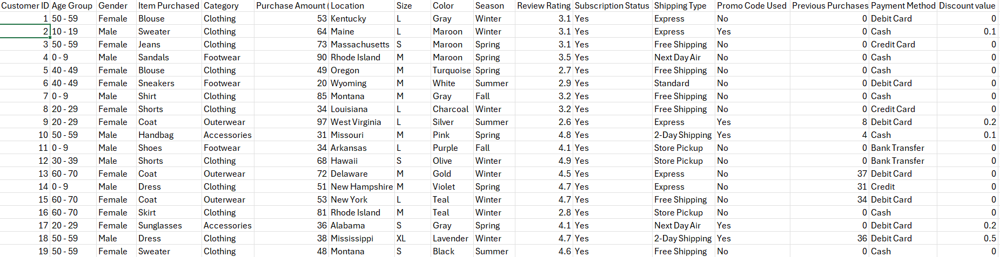
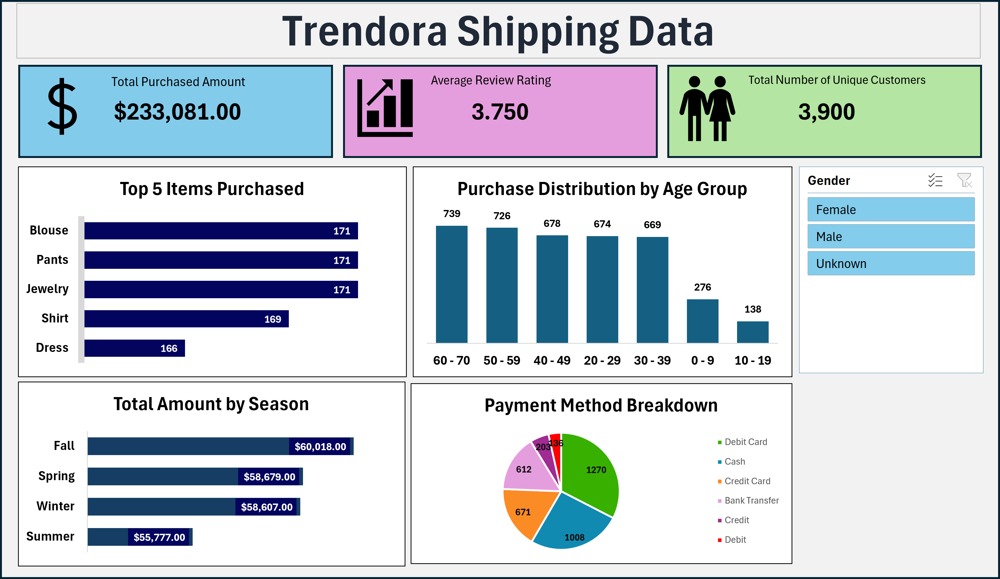

# Trendora Shipping Data Analysis

## Executive Summary
The Trendora Shopping Data Analysis examines customer purchase records to understand purchasing behavior, product demand, customer demographics, payment preferences, and seasonal sales performance. The findings provide useful insights that can help improve inventory planning, customer targeting, seasonal marketing, payment options, and customer satisfaction.

## Business Context
Trendora operates in a retail environment where understanding customer purchasing behavior is important for making effective business decisions. The objective is to understand what customers buy, how they prefer to pay, and when they spend the most in order to improve marketing campaigns, customer engagement, and overall sales performance.

## Objectives
This report addresses the following key questions:
- Determine the total purchased amount generated.
- Identify the most frequently purchased products.
- Analyze purchasing behavior across different age groups.
- Determine which season generates the highest purchase amount.
- Identify the customers’ preferred most payment methods

## Data Overview
The Trendora dataset contains 3,900 rows and 17 columns. It represents 3,900 unique customers and contains information about customer demographics, products purchased, purchase amounts, seasons, payment methods, review ratings, and other customer purchase details.

## Data Preview

## Key Findings
- The Total Purchase Amount was $233,081.
- The total number of unique customers was 3,900.
- Customers used different payment methods, including Cash, Credit Card, Bank Transfer, Credit,   Debit, and Debit Card. Debit Card was the most frequently used payment method.
- Fall was Trendora's strongest season by total purchase amount, recording $60,018.

## Dashboard

## Data Cleaning and Transformation
- Standardized the Gender column by changing abbreviated values: “F” to “Female” and “M” to “Male”, while blank values were categorized as “Unknown.”
- The Discount column contained missing values, which were handled appropriately during the analysis so they would not interfere with the calculations.
- The data was organized into useful analytical dimensions to create PivotTables, PivotCharts, KPIs, and the final dashboard.

## Detailed Findings & Analysis
### Product Analysis
- The analysis shows that Blouse, Pants, and Jewelry were the most frequently purchased items, with 171 purchases each.
- Shirt followed with 169 purchases, while Dress recorded 166 purchases.
- This suggests that these products had the strongest purchase frequency and should receive attention when planning inventory and promotional campaigns.

### Customer Age Analysis
- The 60–70 age group recorded the highest purchase count at 739, followed by the 50–59 age group with 726.
- Customers in the 10–19 age group recorded the lowest number of purchases at 138.
- This shows that older customer groups represent an important segment of Trendora's customer base.

### Seasonal Analysis
- Fall generated the highest total purchase amount at $60,018.
- Summer recorded the lowest at $55,777.
- The difference between Fall and Summer was only $4,241, indicating that Trendora's purchase value remained relatively consistent across the four seasons.

### Payment Analysis
- Debit Card was the most popular payment method, with 1,270 transactions, representing approximately 32.6% of all transactions.
- Cash followed with 1,008 transactions, representing approximately 25.8%.
- This shows that both card and cash payments remain important to Trendora customers.

### Customer Satisfaction
- The average customer review rating was 3.75 out of 5.
- This indicates generally positive customer feedback, although there is still room for Trendora to improve customer satisfaction and move closer to a higher average rating.

## Recommendations
- Prioritize high-demand products such as Blouses, Pants, and Jewelry, which recorded the highest purchase frequency.
- Since the 60–70 and 50–59 age groups recorded the highest purchase volumes, Should develop targeted marketing campaigns, product recommendations, and promotions for these customer groups.
- Since Fall recorded the highest purchase amount, could use this period for stronger promotional campaigns, new product launches, and targeted advertising.
- Although Debit Card was the most popular payment method, Cash and Credit Card were also widely used. It should continue offering multiple payment options to accommodate different customer preferences.
- With an average review rating of 3.75, Trendora should Improve the customer experience by looking into lower-rated purchases and identify opportunities to improve product quality, delivery, customer service, and the overall shopping experience.

## Tools Used
### Microsoft Excel
The following Excel features were used:
- Data cleaning 
- Excel formulas 
- PivotTables 
- PivotCharts 
- Slicers 
- Dashboard development

## Conclusion
Overall, the Trendora Shopping Data analysis helped me understand the company's customer purchasing behavior and sales performance. The analysis showed the most purchased products, the age groups with the highest purchases, the best-performing season, and the most preferred payment method. These insights can help Trendora make better decisions when planning inventory, marketing, and improving the customer
